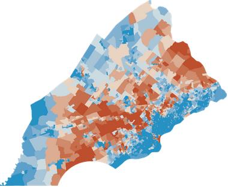
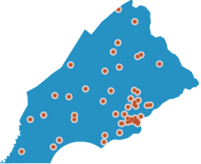
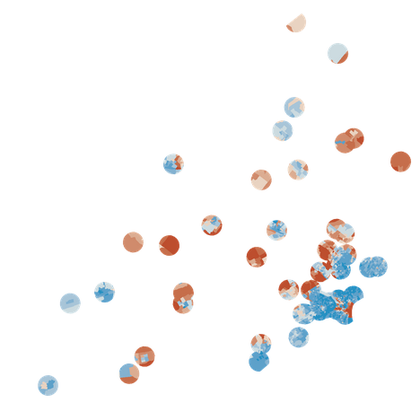

Web Service Tutorial
====================

In this tutorial we will walk through building web services using Spray and GeoTrellis from scratch. 

`Spray`__ is an actor-based framework built on top of `Akka`__ and provides an excellent way to build a RESTful, lightweight and asynchronous web service.

__ http://spray.io/
__ http://akka.io/

Project Structure
-----------------

We’ll be using `sbt`__  as our build tool. The GeoTrellis code base comes with an sbt launching script that will download the appropriate version of sbt and run it; however for the purpose of this tutorial I will assume you have sbt already installed on your system (see the `sbt installation documentation`__ for help).

Folders
^^^^^^^

First, we need to set up the folder structure of our project. We will follow the `recommended directory structure`__ for a simple sbt project:

__ http://www.scala-sbt.org/
__ http://www.scala-sbt.org/release/docs/Getting-Started/Setup.html#installing-sbt
__ http://www.scala-sbt.org/release/docs/Getting-Started/Directories.html

.. code-block:: console

  src
  ├── main
  │   ├── resources
  │   └── scala
  └── test
      └── scala

build.sbt
^^^^^^^^^

Now we need to create a ``build.sbt`` file in the root folder to tell sbt how we’re going to build our project, and what dependencies we’ll use. This will pull in the GeoTrellis library, `spray-router`__ to provide us with a DLS to define routes for a RESTful API, and `spray-can`__ to give us an HTTP server.

__ http://spray.io/documentation/1.2.0/spray-routing/
__ http://spray.io/documentation/1.2.0/spray-can/

.. literalinclude:: code/build.sbt
	:language: scala

RESTful Service
---------------

Our first file will be ``src/main/scala/Main.scala``, with a main method that will setup an Akka actor system for our service and bind it to a listener on an HTTP port.

.. literalinclude:: code/Main.scala
	:language: scala

Service Actor
^^^^^^^^^^^^^
Next we will create ``src/main/scala/GeoTrellisServiceActor.scala`` to define our service:

.. literalinclude:: code/GeoTrellisServiceActor.scala
	:language: scala

**Note:** While we could have started defining our service here it is good practice to separate that definition into a trait such that it can be easily re-used with `spray-testkit`__ for testing. A test class using ScalaTest might look like this:

__ http://spray.io/documentation/1.2.0/spray-testkit/

.. code-block:: scala

  class GeoTrellisServiceSpec 
    extends FlatSpec 
    with ScalatestRouteTest 
    with GeoTrellisService {
    
    ...
    
  }

HttpService
^^^^^^^^^^^
Finally we create ``src/main/scala/GeoTrellisService.scala`` where we will define our route structure.

.. code-block:: scala

  package tutorial

  import spray.routing.HttpService

  trait GeoTrellisService extends HttpService {

    def pingRoute = path("ping") {
      get { complete("pong!") }
    }

    def pongRoute = path("pong") {
      get { complete("pong!?") }
    }

    def rootRoute = pingRoute ~ pongRoute
  }

What we create with Spray is an tree of objects, called `directives`__, that behaves much like a decision tree. When a request comes in it is handed to the root object, ``rootRoute`` , which decides whether its a partial match, pass it on, it's no match, reject and pass it to the next node on the same level, or it's a complete, generate a response. Routes are aggregated using the ``~`` operator as we see happening with ``rootRoute``. You can read more about this on the `spray documentation site`__.

__ http://spray.io/documentation/1.1-SNAPSHOT/spray-routing/key-concepts/directives/
__ http://spray.io/documentation/1.2.0/spray-routing/key-concepts/routes/

Now we are able to verify that the service runs by using the ``run`` command in sbt and opening ``http://localhost:8000/ping`` and seeing the expected response of ``pong!``

**Note:** It is good practice to define routes as ``def`` s to avoid bewildering intitilization problems.

Using GeoTrellis
----------------

Now we are ready to start using GeoTrellis. When we use GeoTrellis we are building objects that know how to perform Operation(s) and in what order. However the work is delayed until either ``.run`` or ``.get`` is called. 

Lets look at some code. First we'll need these imports for the rest of the tutorial:

.. includecode:: code/GeoTrellisService.scala
  :snippet: Imports

Draw a Raster
^^^^^^^^^^^^^

Lets make an endpoint that will load a raster of a given name and render it to PNG. Note that ``pathPrefix`` directive wraps an anonymous function that will receive a URL segment when a request comes in and will know how to ``complete{ }`` it. 

.. includecode:: code/GeoTrellisService.scala
  :snippet: RasterRoute
  }

:ref:`RasterSource` is an object that represents the result of an operation that loads a raster with ID of "RASTER_NAME" from the catalog in the future. We are able to transform the result of this operation by using the methods defined on ``RasterSource``, such as ``.renderPng()``, ``localMap``, etc.  Note that ``.renderPng(_)`` transforms a ``RasterSource`` into a ``ValueSource``, essentially reducing a future collection of values, a raster, into a single one value, PNG file. We will see shortly that two RasterSources can be combined with ``*`` operation.

RasterSource is a type of :ref:`DataSource`. This architecture is new as of ``0.9``. 

GeoTrellis Server
^^^^^^^^^^^^^^^^^
Once we call ``png.run`` we hand off the Operation structure we built to GeoTrellis server for evaluation. Lets take a look at the definition of ``.run(_)``: 

.. code-block:: scala

  def run(implicit server:process.Server) = server.run(this)

The implicit parameter is the GeoTrellis server instance that was imported from ``geotrellis._``:

.. code-block:: scala

  package object geotrellis {
    implicit lazy val server: process.Server = GeoTrellis.server
    ...
  }

Being an implicit value it is automatically provided to all calls to ``.run`` and being lazy it is not initialized until the first call. 
We are returned an ``OperationResult`` that can either be ``Ceomplete`` or ``Error``, we should pattern match on the result to handle either outcomes. Either way we are given a history of execution. This is what it looks like on an ``Error``:

.. code-block:: console

  MapOp1
     ├─────LoadRasterDefinition
     │               ├────────────Literal
     │               │               └───Result: LayerId (in 0 ms)
     │               └──────────Result: ERROR: No raster with name 
     │                          CANT_FIND_THIS exists in the catalog. (in 3 ms): 
     └───Result: ERROR: No raster with name CANT_FIND_THIS exists in the catalog. (in 7 ms): 
     

Catalog
^^^^^^^
A ``Catalog`` is what a GeoTrellis server uses to define the data that can be used in the system. It is defined with a JSON file that describes where the data is held. Let’s define our data now by creating a directory in the root directory called ``data`` and create the file ``data/catalog.json``:

.. code-block:: json

  {
   "catalog": "Catalog of Tutorial Data",
   "stores": [
    {
     "store": "tutoral:fs",
     "params": {
       "type": "fs",
       "path": "arg",
       "cacheAll": "no"
      }
    }
   ]
  }

This catalog defines one data store, which is the directory ``data/arg``. This means any raster in ARG format found in that directory will be available to the Server. For a description of the ARG format, see the documentation on loading data. Note that a data store cannot be the same directory as the catalog.json lives, because the Server will consider any JSON file in a data store directory to be a layer definition for an :ref:`ARG` file.

You can `download the data`__ from the completed tutorial project. It contains two rasters: 

  - ``SBN_inc_percap`` (Income per capita in Philadelphia area) -
  - ``SBN_farm_mkt`` (Proximity to a farmers market).

__ https://github.com/echeipesh/geotrellis-spray-tutorial/releases/download/1.0/data.zip

These and other rasters are also included in GeoTrellis project and can be viewed using :ref:`geotrellis-admin`

Draw!
^^^^^

Now that we have the data and the catalog defined we can finally test the service. Update the ``rootRoute`` to include the ``rasterRoute``: 

.. code-block:: scala

  def rootRoute = pingRoute ~ pongRoute ~ rasterRoute
  
... and restart the server. Lets see:

``http://localhost:8000/raster/SBN_inc_percap/draw``

``http://localhost:8000/raster/SBN_farm_mkt/draw``

We used blue to red ``ColorBreaks``; the blue represents lower values while red represent higher location values.

Error!
^^^^^^

Suppose there is an exception in our process, perhaps the raster we are trying to load does not exist:

``http://localhost:8000/raster/SBN_inc_NOcap/draw``

All we get back is this:

.. code-block:: console

  There was an internal server error.

Fortunately ``runRoute`` has an implicit dependency on an `ExceptionHandler`__, a partial function that matches on error and completes a request.

__ http://spray.io/documentation/1.2.0/spray-routing/key-concepts/exception-handling/

We drop this definition into our ``GeoTrellisService`` trait and reap the benefits:

.. includecode:: code/GeoTrellisService.scala
  :snippet: ExceptionHandler
  
.. code-block:: console

  Exception: No raster with name SBN_inc_NOcap exists in the catalog.
  

Raster Analysis
---------------

One may wonder if perhaps the location of farmers markets are somehow correlated to the average income of the neighborhood, in the same way that location of Whole Foods has been shown to be. 

Average Income
^^^^^^^^^^^^^^

What is the average income of the Philadelphia area. 

.. code-block:: scala

  val raster: RasterSource = RasterSource("SBN_inc_percap")
  val histogramSource: ValueSource[Histogram] = raster.histogram()
  val histogram = histogramSource.get
  val stats = histogram.generateStatistics()
  println(s"Mean income in Philadelphia: ${stats.mean}")
  
.. code-block:: scala

  Mean income in Philadelphia: 26.62950322073986
  
**Note:** The data in the ``SBN_inc_percap`` has been normalized, so the answers will have meaning in comparison only.

This time we called ``.get`` rather than ``.run`` to trigger the computation. This is a shortcut method that will return a value if there is a ``Complete`` result and will throw an ``RuntimeException`` if there is and ``Error``. Since we're intercepting all exceptions in our service it is convenient for us to use it.

Neighborhood Income
^^^^^^^^^^^^^^^^^^^

To filter out all locations that are "too far" from the farmers markets we can generate a mask raster in this manner and use it so:

.. code-block:: scala

    val incomePerCapRaster = RasterSource("SBN_inc_percap")
    val farmMarketRaster = RasterSource("SBN_farm_mkt")
    val farmMarketMaskRaster = farmMarketRaster.localMap{ 
        x => if (x > 1) 1 else NODATA 
      }
    val filteredIncomeRaster = incomePerCapRaster *  farmMarketMaskRaster
    val histogramSource: ValueSource[Histogram] = filteredIncomeRaster.histogram
    val statsSource = histogramSource.map{ h=> generateStatistics() }
    val stats = statsSource.get
    println(s"Mean income near farmers markets: ${stats.mean}")
    
.. code-block:: scala

  Mean income near farmers markets: 22.955766888898363

Notice that we mapped over every location/cell in the ``farmMarketRaster`` and replaced everything less than 1 with ``NODATA``. This is a constant defined in GeoTrellis to represent :ref:`NoData`. For Integer rasters it is defined to be ``Int.MinValue``. All other values in the ``farmMarketRaster`` are replaced with 1, producing a convenient mask.

Also important to note is that we have created a new RasterSource, `filteredIncomeRaster` that is a combination of two other rasters. The ``*`` operation performs a multiplication of every location in the two rasters. 

Why?
^^^^

The perhaps surprising result is that the difference in mean income is minor and if anything the proximity to farmers market to inversely related income per capita. Lets draw the ``filteredIncomeRaster`` raster to see why:

Its a little difficult to tell without an overlay but it's apparent that the city of Philadelphia has a ready access to farmers markets but on average is lower income. 

Analyze Route
^^^^^^^^^^^^^

Here is how we can wrap this functionality in a Spray route:

.. includecode:: code/GeoTrellisService.scala
  :snippet: AnalyzeRoute

First notice that we are using a URL parameter ``cutoff`` to determine where we will start the mask. The ``parameter`` directive requires a function that will receive the `parameters`__. It allows us to server requests with following URL:

__ http://spray.io/documentation/1.2.0/spray-routing/parameter-directives/parameters/#parameters

.. code-block:: console

  http://localhost:8000/analyze/draw?cutoff=1
  

Sample Project
--------------

Please look over the fully `completed project`__ that has all of the above code and more. 

__ https://github.com/geotrellis/geotrellis-spray-tutorial

